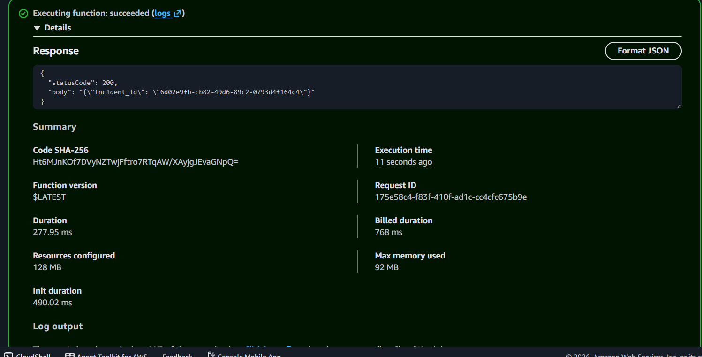
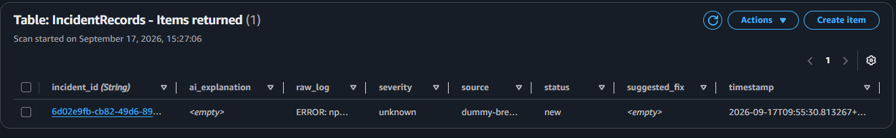

# Incident Command Center

**AI Incident & Anomaly Command Center** — an event-driven AWS pipeline that detects CI/CD pipeline failures automatically, generates a plain-English root-cause explanation using Amazon Bedrock, and displays it on a live dashboard.

Built for **First Commit** (Bharat Builds Tour, Sept 17–20, 2026) by **Team Code & Chill**.

---

## Team

| Name | Role |
|------|------|
| Varun Nair | AWS / DevOps / Infrastructure (Team Leader) |
| Rahul Bhagwat | AI Layer (Amazon Bedrock) |
| Prapti Sharma | Backend (Spring Boot) & Frontend (React) |

---

## Architecture

```
Dummy breakable GitHub repo
        │
        ▼
Amazon EventBridge (detects pipeline failure)
        │
        ▼
AWS Lambda (Python) — pulls failure logs
        │
        ▼
Amazon Bedrock (Claude) — root cause + fix
        │
        ▼
Amazon DynamoDB — stores incident record
        │
        ▼
Spring Boot API → React Dashboard → AWS Amplify Hosting
```

---
## Progress Log

### Day 1 — Thursday, Sept 17

**Infrastructure and Lambda setup completed by Varun:**

- ✅ Repository, branches, and team contracts locked (DynamoDB schema, Bedrock response shape, API response shape)
- ✅ IAM role and least-privilege policy defined and deployed via Terraform (`incident-lambda-execution-role`)
- ✅ DynamoDB table (`IncidentRecords`) deployed via Terraform
- ✅ Lambda function (`incident-log-handler`) written and deployed via Terraform
- ✅ End-to-end manual test completed successfully — Lambda executed, generated a real incident record, and wrote it correctly to DynamoDB

**Verification — Lambda execution succeeded:**



Response:
```json
{
  "statusCode": 200,
  "body": "{\"incident_id\": \"6d02e9fb-cb82-49d6-89c2-0793d4f164c4\"}"
}
```

**Verification — DynamoDB record written correctly:**



Record matches the locked schema exactly:
- `incident_id`: `6d02e9fb-cb82-49d6-89c2-0793d4f164c4`
- `raw_log`: hardcoded sample failure log
- `severity`: `unknown` (placeholder — filled by Bedrock during Friday's integration)
- `status`: `new`
- `source`: `dummy-breakable-repo`
- `ai_explanation` / `suggested_fix`: empty (placeholder — filled by Rahul's Bedrock integration on Friday)

**Status: Varun's Day 1 infrastructure and Lambda setup is fully complete and verified working end-to-end**, independently of the AI and frontend layers. Ready for Friday's integration with Rahul's Bedrock call.
---

**Backend & Frontend setup completed by Prapti:**

- ✅ Spring Boot REST API scaffolded (`com.codechill.incidentapi`) with `Incident` model matching the locked contract (incident_id, timestamp, source, raw_log, ai_explanation, severity, status)
- ✅ `IncidentController` exposes `GET /api/incidents` returning sample incident records
- ✅ CORS configured via `@CrossOrigin(origins = "http://localhost:3000")` for local React dev
- ✅ React dashboard scaffolded with live incident feed, AI explanation panel, severity color-coding, and expandable raw-log viewer
- ✅ Axios integrated in React to consume the Spring Boot API
- ✅ Frontend → Backend integration verified locally — dashboard renders incident cards with AI explanations and severity badges
- ✅ Both API (port 8081) and Dashboard (port 3000) running concurrently for end-to-end local demo

**Verification — Spring Boot API response:**

```
GET http://localhost:8081/api/incidents
```

```json
[
  {
    "incident_id": "INC-001",
    "timestamp": "2026-09-17T10:30:00",
    "source": "github-actions",
    "raw_log": "Error: Cannot find module 'express'",
    "ai_explanation": "The build failed because the 'express' package is missing. Run 'npm install express' and try again.",
    "severity": "HIGH",
    "status": "OPEN"
  },
  {
    "incident_id": "INC-002",
    "timestamp": "2026-09-17T11:15:00",
    "source": "github-actions",
    "raw_log": "TypeError: undefined is not a function at line 42",
    "ai_explanation": "There is a type error on line 42. You are calling a function on something that is undefined. Check that the variable is initialized before use.",
    "severity": "MEDIUM",
    "status": "OPEN"
  }
]
```

**Verification — React dashboard rendering:**

Dashboard renders each incident as a card with:

- Severity badge (color-coded: HIGH = red, MEDIUM = orange, LOW = green)
- Timestamp and source
- AI explanation panel
- Collapsible raw-log viewer

**Status: Prapti's Day 1 backend + frontend stack is fully complete and verified working end-to-end with mock data**, independently of Varun's Lambda/DynamoDB and Rahul's Bedrock integration. Ready for Friday's swap to real DynamoDB-backed data.

---

## Tech Stack

**Infrastructure (Varun):** AWS IAM, Terraform, AWS Lambda (Python), Amazon EventBridge, Amazon CloudWatch Logs, Amazon DynamoDB

**AI (Rahul):** Amazon Bedrock (Claude), Python

**Backend/Frontend (Prapti):** Java Spring Boot, React, AWS Amplify Hosting

---

## AI Tools Used

GitHub Copilot
